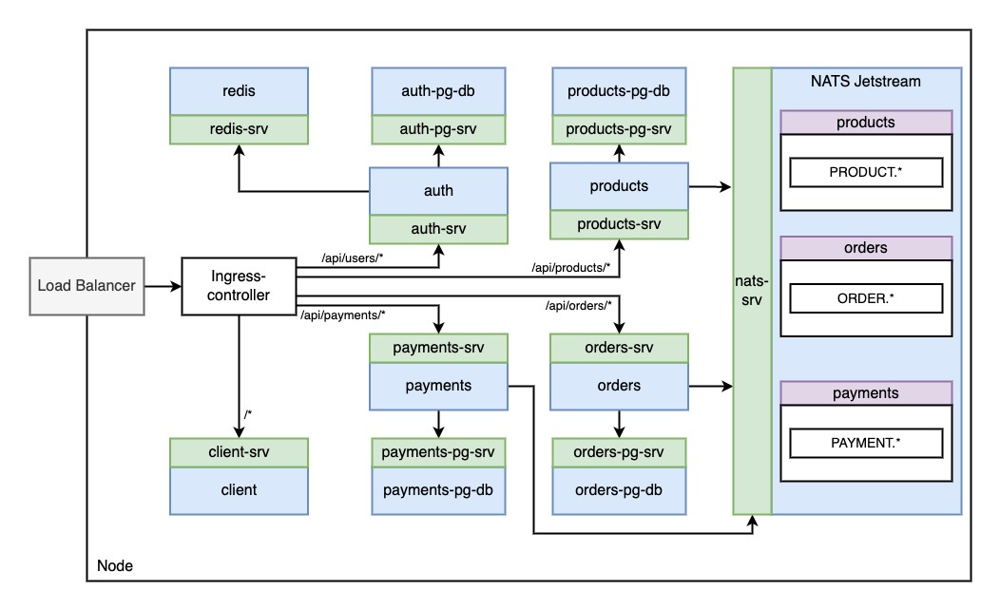

## Zone

Zone a C2C platform, build with scalability and availability in mind.

Zone uses a custom utility library [zone-common](https://pypi.org/project/zone-common/). Github: [zone-common](https://github.com/Shreyaschorge/zone_common)

### Architecture

This application is divided into 5 micro-services.

1. Authentication

   1. Password Encryption: [Argon2](https://en.wikipedia.org/wiki/Argon2).
   2. Mechanism: [JWT](https://jwt.io/).
   3. Pattern: Access and refresh tokens.

2. Products

   1. Create, Fetch and Update Products.

3. Orders

   1. Create, Update Orders

4. Payments

   1. Create Payments

5. Client

   1. Provides UI to end users to interact with the app.

Messaging System used to communicate between these services is [NATS](https://nats.io/).

Messages are persisted using [NATS-Jetstream](https://docs.nats.io/nats-concepts/jetstream).

The zone has 3 streams that persist messages.

    1. products
    2. orders
    3. payments

[Example of NATS](https://docs.nats.io/nats-concepts/jetstream/consumers/example_configuration)

Events/messages flowing in the application:

    1. PRODUCT.created
    2. PRODUCT.updated
    3. ORDER.created
    4. ORDER.cancelled
    5. PAYMENT.created

[Queue Groups](https://docs.nats.io/nats-concepts/core-nats/queue)

Type of QueueGroups in the application

    1. product_created_listeners
    2. product_updated_listeners
    3. payment_created_listeners
    4. order_created_listeners
    5. order_cancelled_listeners

All Listeners/Consumers are of type [Queue Push Consumers.](https://natsbyexample.com/examples/jetstream/queue-push-consumer/)

### UI Demo.

https://www.loom.com/share/40319d495c8d4bae9639012b0ef93b9c

### Installation Guide

Prerequisite to run the application

[Docker](https://docs.docker.com/engine/install/), [Kubernetes](https://kubernetes.io/docs/tasks/tools/), [Skaffold](https://skaffold.dev/docs/install/), [nats-cli](https://github.com/nats-io/natscli) must be install

Inside K8's cluster

Install [IngressController](https://kubernetes.github.io/ingress-nginx/), [cert-manager](https://cert-manager.io/docs/installation/) using helm.

#### Steps to run the project

1.  git clone https://github.com/Shreyaschorge/Zone.git

2.  cd Zone

3.  Create secrets
    Refer commands in (\_secret.txt).

4.  Create a [Self-signed Kubernetes SSL certificate](https://www.youtube.com/watch?v=IQ3G8Z1myMw).

5.  configure [nats-cli](https://github.com/nats-io/natscli).

6.  Setup NATS streams.

    create `products`, `orders` and `payments` streams.

    use command `nats stream add`

    when prompted subject add following subjects for above streams repectively `PRODUCT.\*`, `ORDER.\*`, `PAYMENT.\*`

    here `*` is subject [wildcard](https://docs.nats.io/nats-concepts/subjects#wildcards)

    example

          StreamName: products
          Subject: PRODUCT.*
          .
          .
          . (default-options can be used for the rest)

    use command `nats stream ls` to check if streams.

7.  In PersistentVolume Object replace `hostPath` in all files in infra/k8s.

    - auth-pg-pvolume.yaml
    - nats-jetstream-pvolume.yaml
    - orders-pg-pvolume.yaml
    - payments-pg-pvolume.yaml
    - products-pg-pvolume.yaml
    - redis-pvolume.yaml

8.  run `skaffold dev`
